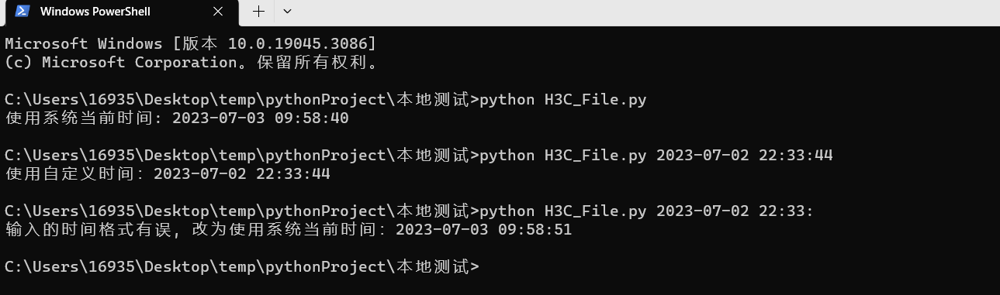

## 简介

---

把该脚本放在 H3C 漏扫工具导出的 HTML 报告中的目录下，和 HostReport.html 文件、target 文件夹在同一目录中，命令行输入：

```python
python H3C_File.py
```

运行成功后导出的报告时间会全部变为当前时间，日期修改为当前日期，结束扫描时间变为当前时间

统一按照 年-月-日 时:分:秒 的格式，开始扫描时间变为结束扫描时间 - 扫描时间 得到的值

支持自定义时间，运行程序时后面追加参数；不追加参数默认使用系统时间。

```python
python H3C_File.py 2023-07-03 12:22:33
```

## 运行截图

----

